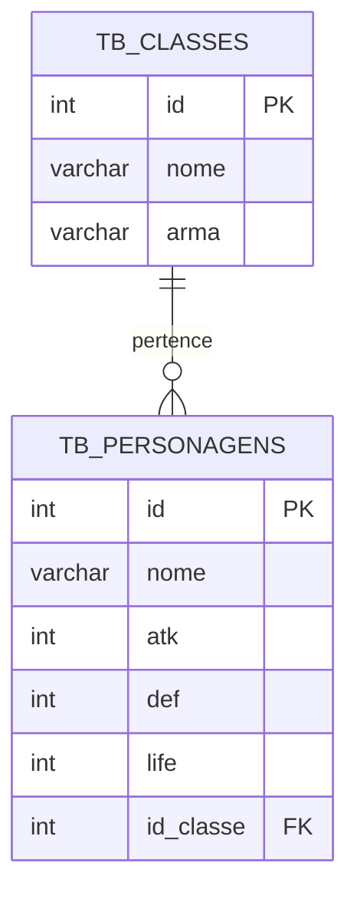
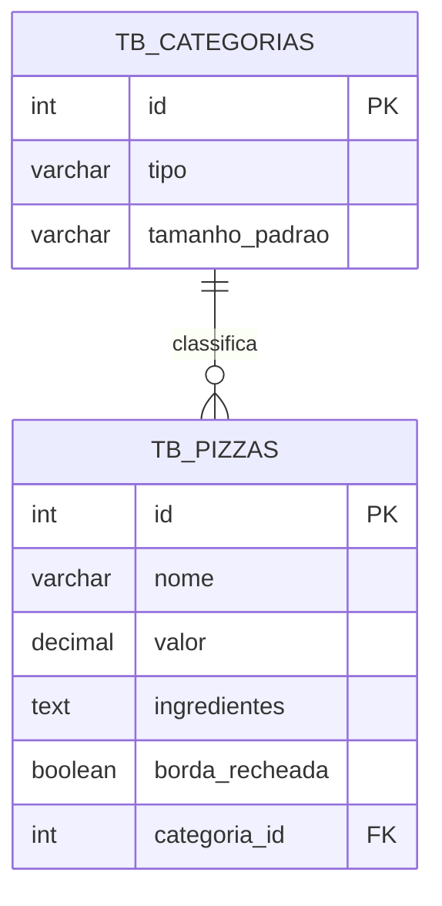
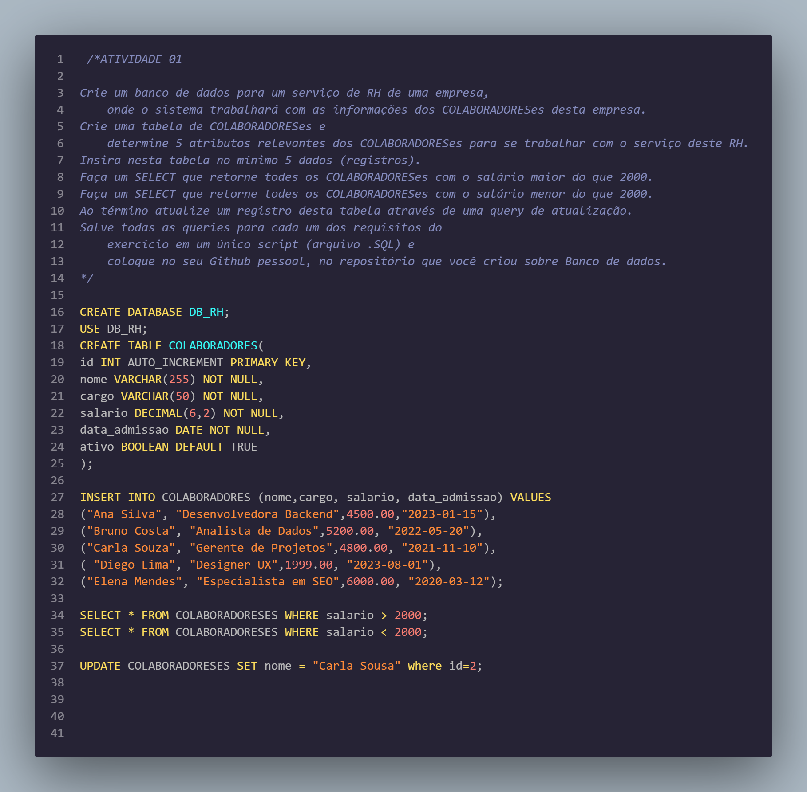
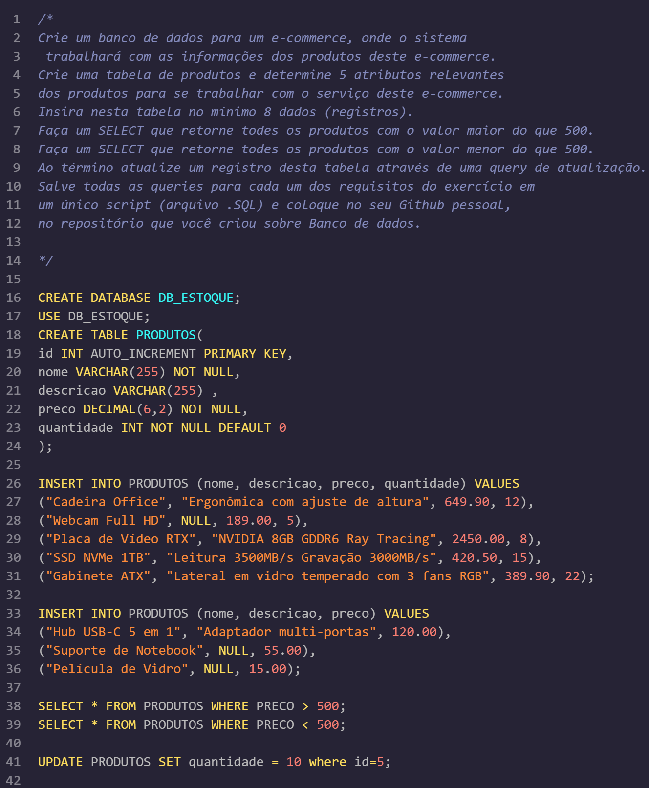
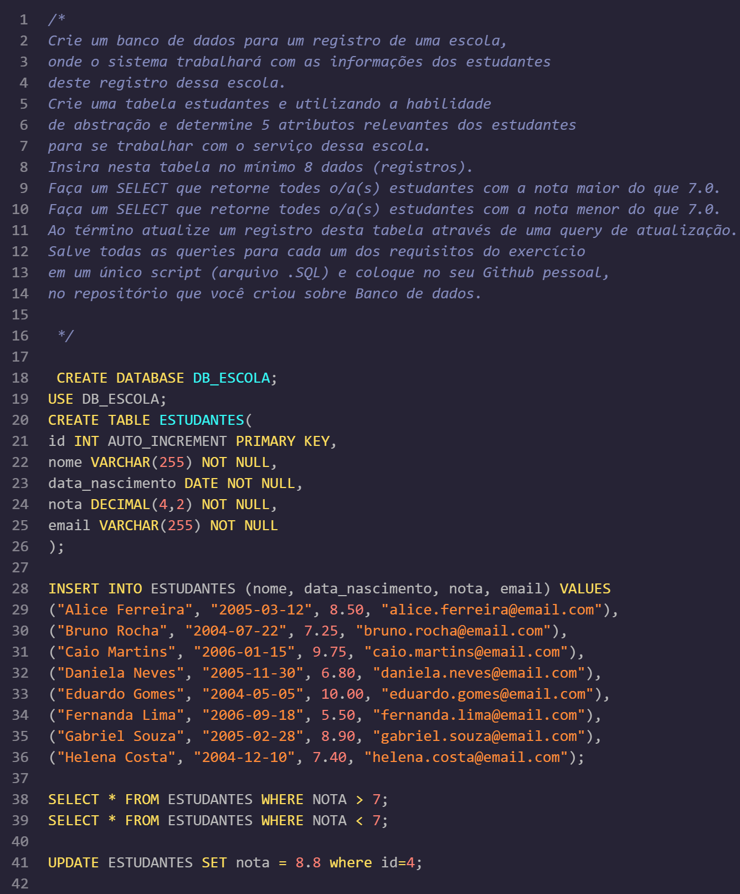
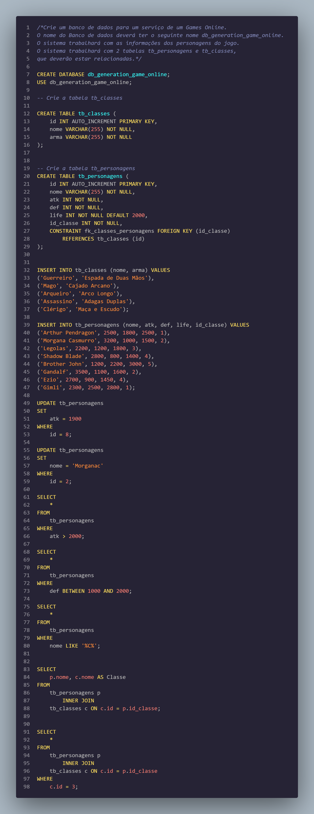
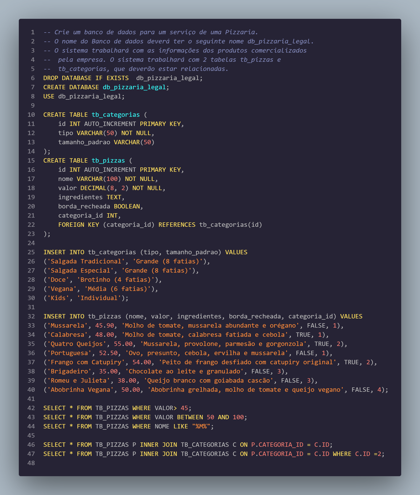

# 🗄️ Repositório de Modelagem & Banco de Dados MySQL (Generation Brasil JS13)


---

## 📖 Visão Geral

Repositório dedicado ao armazenamento, versionamento e documentação dos scripts práticos desenvolvidos durante o módulo de **Banco de Dados Relacional (SQL / MySQL)** no bootcamp **Generation Brasil (Turma JS13)**.

Os exercícios cobrem desde os fundamentos de **DDL (Data Definition Language)** e **DML (Data Manipulation Language)** até modelagens relacionais complexas envolvendo cardinalidade 1:N (um para muitos), integridade referencial com **Chaves Estrangeiras (Foreign Keys)**, consultas avançadas com junção de tabelas via **INNER JOIN**, funções agregadoras e filtros condicionais com operadores relacionais e lógicos.

---

## ✨ Conteúdo e Exercícios Cobertos

### 📂 Aula 03 — Modelagem Unária e Manipulação de Dados
Foco em criação de esquemas, restrições de integridade básica (`PRIMARY KEY`, `AUTO_INCREMENT`, `NOT NULL`) e consultas condicionais simples:

1. **Gestão de Recursos Humanos (`Aula_03/Exercicio_1_RH.sql`):**
   * Banco: `DB_RH` | Tabela: `tb_colaboradores`
   * Atributos: Nome, cargo, departamento, salário e data de admissão.
   * Queries: Filtros salariais (`salario > 2000` e `salario < 2000`) e atualização cadastral (`UPDATE`).
2. **Controle de Estoque e E-commerce (`Aula_03/Exercicio_2_ESTOQUE.sql`):**
   * Banco: `db_estoque` | Tabela: `tb_produtos`
   * Atributos: Nome, categoria, quantidade, valor e data de validade/entrada.
   * Queries: Filtros por faixa de valor (`valor > 500` e `valor < 500`) e ajuste de preços.
3. **Registro Escolar (`Aula_03/Exercicio_3_ESCOLA.sql`):**
   * Banco: `db_escola` | Tabela: `tb_estudantes`
   * Atributos: Nome, turma, turno, nota decimal e data de nascimento.
   * Queries: Filtro de desempenho acadêmico (`nota > 7.0` e `nota < 7.0`) e correções de notas.

---

### 📂 Aula 04 — Modelagem Relacional e Junções (1:N com INNER JOIN)
Foco em modelagem relacional de múltiplas entidades vinculadas por chaves estrangeiras:

1. **Games Online (`Aula_04/Exercicio_1_Game.sql`):**
   * Banco: `db_generation_game_online`
   * Entidades: `tb_classes` (1) e `tb_personagens` (N).
   * Relacionamento: `CONSTRAINT fk_classes_personagens FOREIGN KEY (id_classe) REFERENCES tb_classes(id)`.
   * Queries: Filtros por atributos de poder (`atk > 2000`, `def BETWEEN 1000 AND 2000`), busca por padrão textual (`nome LIKE '%C%'`) e cruzamento de classes com `INNER JOIN`.
2. **Pizzaria Legal (`Aula_04/Exercicio_2_Pizzaria.sql`):**
   * Banco: `db_pizzaria_legal`
   * Entidades: `tb_categorias` (1) e `tb_pizzas` (N).
   * Relacionamento: `FOREIGN KEY (categoria_id) REFERENCES tb_categorias(id)`.
   * Queries: Filtros de preços (`valor > 45.00`, `valor BETWEEN 50 AND 100`), busca por caractere (`nome LIKE '%M%'`), junção `INNER JOIN` de produtos com categorias e filtro especializado por categoria.

---

## 🎯 Diferenciais e Conceitos Técnicos Aplicados

* **Integridade Referencial & Constraints:** Uso rigoroso de `PRIMARY KEY`, `AUTO_INCREMENT`, `FOREIGN KEY` e valores padrão (`DEFAULT`).
* **Precisão Numérica Financeira:** Utilização de `DECIMAL(8, 2)` em valores monetários para prevenir erros de arredondamento de ponto flutuante.
* **Padronização Internacional:** Datas manipuladas no formato ISO 8601 (`AAAA-MM-DD`).
* **Junções Estruturadas:** Domínio de cláusulas `INNER JOIN ... ON` para recomposição relacional das informações.
* **Consultas com Padrões Textuais:** Uso do operador `LIKE` com wildcards (`%`) para buscas flexíveis no catálogo.

---

## 🏗️ Estrutura do Repositório

```text
generation_JS13_sql/
├── Aula_03/
│   ├── Exercicio_1_RH.sql       # Script DDL/DML/DQL de Recursos Humanos
│   ├── Exercicio_1_RH.png       # Evidência de execução no MySQL Workbench
│   ├── Exercicio_2_ESTOQUE.sql  # Script de controle de estoque de e-commerce
│   ├── Exercicio_2_ESTOQUE.png  # Evidência de execução no MySQL Workbench
│   ├── Exercicio_3_ESCOLA.sql   # Script de registro e notas de estudantes
│   ├── Exercicio_3_ESCOLA.png   # Evidência de execução no MySQL Workbench
│   └── Roleplay BSM - 25-02.pdf # Atividade comportamental integrada da Generation
├── Aula_04/
│   ├── Exercicio_1_Game.sql     # Modelagem relacional e queries do jogo online
│   ├── Exercicio_1_Game.png     # Evidência de execução com INNER JOIN no Workbench
│   ├── Exercicio_2_Pizzaria.sql # Modelagem relacional da pizzaria com categorias
│   └── Exercicio_2_Pizzaria.png # Evidência de execução com INNER JOIN no Workbench
└── README.md                    # Documentação técnica consolidada do repositório
```

---

## 🎲 Diagramas Entidade-Relacionamento (DER)

### 1. Sistema de Game Online (Aula 04 — Exercício 1)


### 2. Sistema da Pizzaria Legal (Aula 04 — Exercício 2)


---

## 📸 Evidências de Execução no Terminal / SGBD

<details>
<summary><b>Visualizar prints de execução dos exercícios (Clique para expandir)</b></summary>

<br />

#### Aula 03 — Exercício 1: Recursos Humanos


#### Aula 03 — Exercício 2: Estoque


#### Aula 03 — Exercício 3: Escola


#### Aula 04 — Exercício 1: Games Online (INNER JOIN)


#### Aula 04 — Exercício 2: Pizzaria Legal (INNER JOIN)


</details>

---

## ⚙️ Como Executar os Scripts

### Opção 1: Via Interface Gráfica (MySQL Workbench ou DBeaver)
1. Conecte-se à sua instância local do MySQL.
2. Abra o arquivo `.sql` correspondente (ex: `File > Open SQL Script`).
3. Execute o script completo (`Ctrl + Shift + Enter` no Workbench) para criar a base, popular os dados e rodar as consultas.

### Opção 2: Via Terminal / Linha de Comando (CLI)
```bash
# Clone o repositório
git clone https://github.com/erickystn/generation_JS13_sql.git
cd generation_JS13_sql

# Execute qualquer script diretamente no MySQL local:
mysql -u root -p < Aula_04/Exercicio_1_Game.sql
mysql -u root -p < Aula_04/Exercicio_2_Pizzaria.sql
```

### Opção 3: Executando com Docker
```bash
# Inicializar um container MySQL 8.0 limpo:
docker run --name mysql-generation -e MYSQL_ROOT_PASSWORD=root -p 3306:3306 -d mysql:8.0

# Executar um script dentro do container:
docker exec -i mysql-generation mysql -uroot -proot < Aula_04/Exercicio_2_Pizzaria.sql
```

---

## 💻 Exemplos de Consultas em Destaque

### Junção Relacional com INNER JOIN (Pizzaria):
```sql
SELECT 
    p.nome AS Pizza,
    p.valor AS Preco,
    c.tipo AS Categoria,
    c.tamanho_padrao AS Tamanho
FROM tb_pizzas p
INNER JOIN tb_categorias c 
    ON p.categoria_id = c.id
WHERE c.tipo LIKE '%Especial%';
```

### Consulta com Filtro de Faixa de Valores e Operadores Lógicos (Games):
```sql
SELECT 
    p.nome AS Personagem,
    p.atk AS PoderAtaque,
    p.def AS PoderDefesa,
    c.nome AS Classe
FROM tb_personagens p
INNER JOIN tb_classes c 
    ON c.id = p.id_classe
WHERE p.def BETWEEN 1000 AND 2000;
```

---

## 📈 Próximos Passos de Estudo (Roadmap)

- [ ] Implementação de **Views** para relatórios frequentes de junção.
- [ ] Criação de **Stored Procedures** e **Functions** para automação de regras financeiras.
- [ ] Implementação de **Triggers** para log de auditoria de alterações em tabelas de preços.
- [ ] Otimização de consultas com criação de **Índices** secundários (`INDEX`).
- [ ] Integração com ORMs de aplicações backend (TypeORM no NestJS e Hibernate no Spring Boot).

---

## 👤 Autor & 📄 Licença

Desenvolvido por **[Ericky Sant'ana](https://github.com/erickystn)** durante as atividades de banco de dados da **Generation Brasil**.

Distribuído sob a licença **MIT**.
